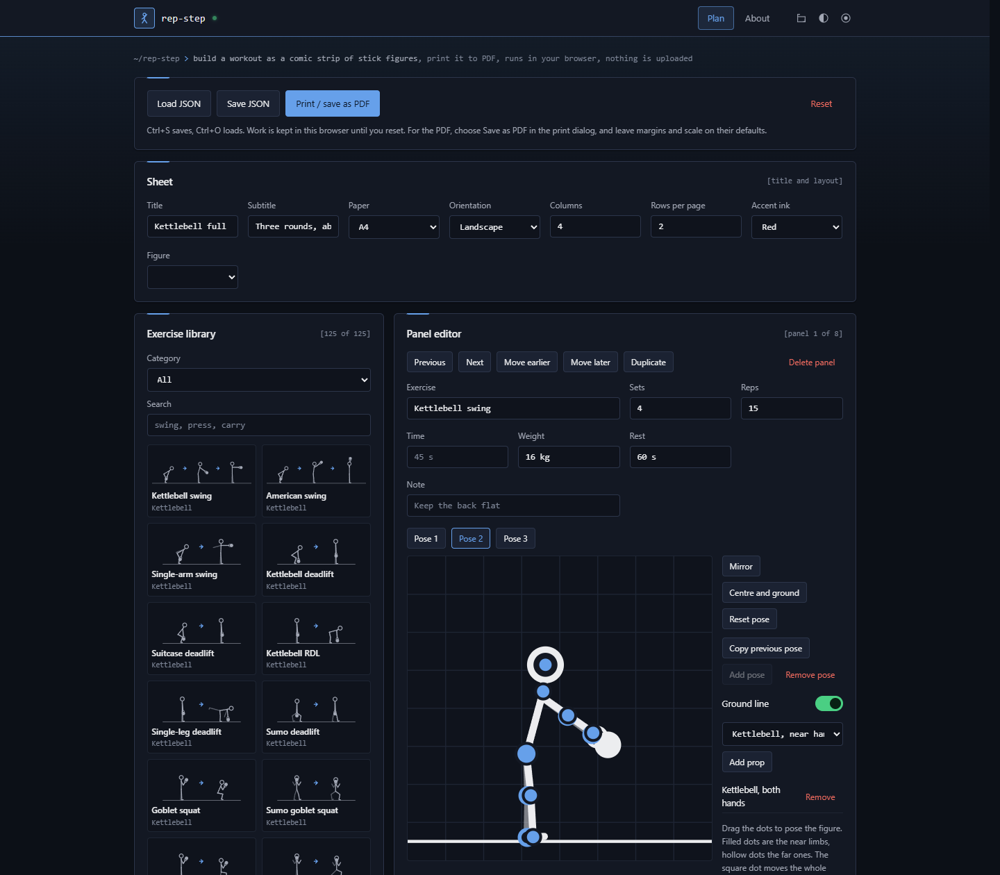
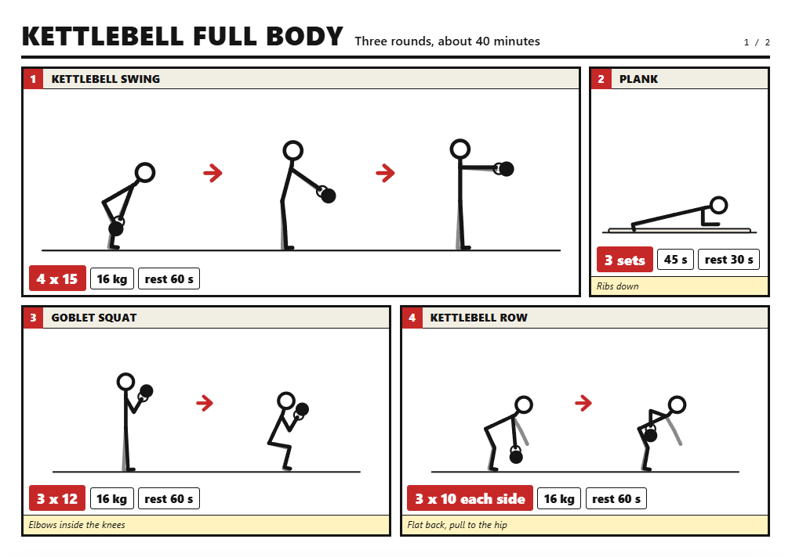
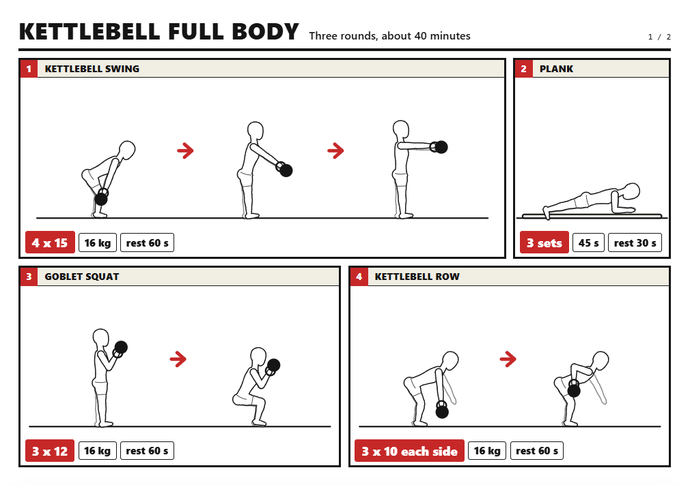
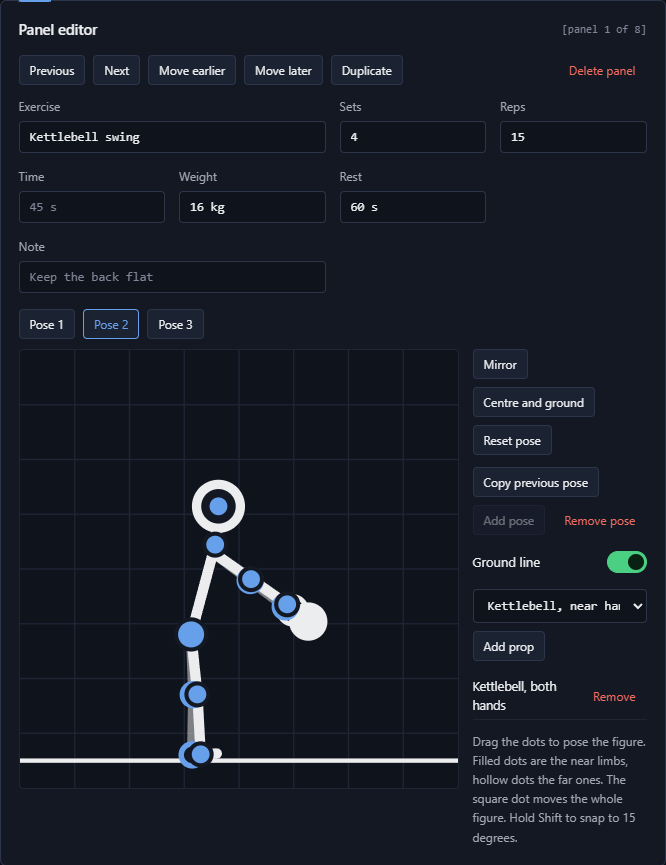
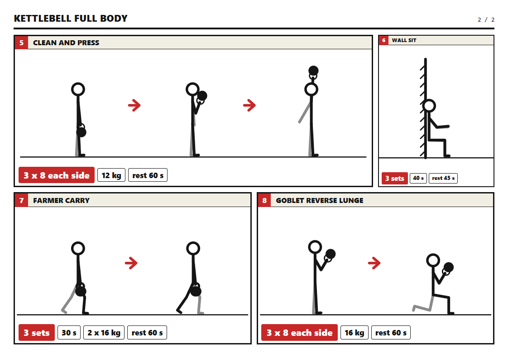
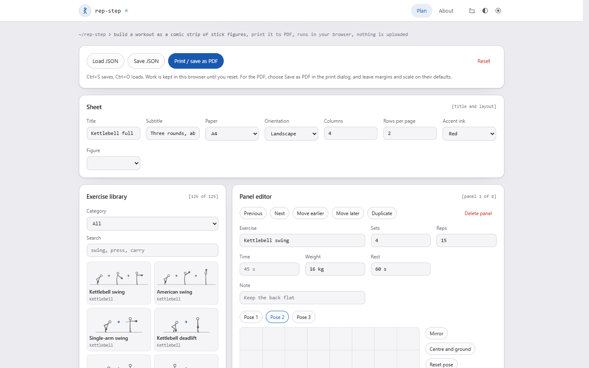

# rep-step

Build a workout as a comic strip of stick figures and print it to PDF for the wall. One file, no build step, no dependencies, no network calls. Open `index.html` and it works, including from `file://`.

Each panel is one exercise with one, two or three poses side by side, plus sets, reps, time, weight, rest and a note. Panels flow across the page like a comic, and a panel with 2 or 3 poses takes 2 or 3 columns.

The sheet that prints, page 1 of a two page plan (A4 landscape, four columns, two rows):

## Using it

1. Pick an exercise from the library to add a panel, or add a blank one.
2. Select a panel (click it in the preview) and edit its text, poses and props.
3. Set paper, orientation, columns and rows per page, and the figure style, in the Sheet panel.
4. Print, and choose Save as PDF as the destination.

## Figures

The Figure setting in the Sheet panel switches the whole plan between two styles. **Stick figure** is the default. **Outline** draws a faceless mannequin in shorts around the same skeleton, so every preset and every pose you have made works in both without any change. The choice is saved with the plan.

The library thumbnails and the pose editor always show sticks, so the drag dots sit on the bones. The outline is for the sheet and the print.

## Posing

Poses are stored as joint angles on a skeleton with fixed bone lengths, so every figure is the same person. Drag a dot to turn that bone around its parent. Everything below it keeps its own angle, so pulling an elbow carries the hand with it.

| Control | Does |
|---|---|
| Filled dots | Near limbs, head and neck |
| Hollow dots | Far limbs, drawn lighter on the sheet |
| Square dot | Moves the whole figure |
| Shift while dragging | Snaps to 15 degrees |
| Mirror | Flips the pose to face the other way |
| Centre and ground | Rests the lowest point on the ground line and centres the figure |
| Copy previous pose | Starts this pose from the one before it |

Props: kettlebell, dumbbell, barbell (front or side view), medicine ball, bench, box, pull-up bar, wall and mat. Held props follow the hand. Scenery props have a dot you can drag.

## PDF

The PDF comes from the browser's own print, so it is vector and stays sharp at A3. The page size and orientation are written into `@page` from the Sheet settings, and the margin is zero, so the browser adds no header or footer. If the coloured chips come out blank, turn on background graphics in the print dialog. The sheet is always dark ink on white, whatever design and mode the tool itself is in.

## Appearance

Four designs (cobalt, chamfer, console, contour), four modes (dark, dusk, sepia, light) and any accent colour, chosen from the buttons at the top right. The sheet ignores all of this and always prints dark ink on white.

## Saving

Save JSON writes the whole plan. Load JSON reads it back, including files saved under the old name `rep-strip`. The plan is also autosaved to this browser. Everything read from a file or from storage is rebuilt field by field through `cleanState()`, so unknown keys are dropped, numbers are clamped and only known props are accepted.

## Layout

Panels are placed left to right. If the next panel will not fit in the row, the previous one stretches to close it. A partly filled last row is left open. `rows` is how many rows fit on a page, and extra rows go onto further pages. Type scales with paper size, so A3 is A4 enlarged.

## Library

125 starter exercises in ten categories: Kettlebell (46, including double-bell work, carries, Turkish get-up, snatch, windmill, halo, around the world, side swing and wood chop), Dumbbell, Barbell, Legs, Push, Pull, Core (with Pilates hundred and roll-up), Cardio, Stretch (with yoga poses such as downward dog, chair and tree) and Mobility (with thread the needle and deep squat). Filter by category or search by name. They live in `LIB_SRC` as plain angle objects, and `buildLib()` grounds and centres each one. To add an exercise, copy an entry and change the angles. Poses are approximations, so expect to nudge some in the editor. The least convincing are the floor poses (child's pose, sit-up, hollow and V-sit holds, knees to chest, thread the needle), side plank and step-up.

## Known gaps

- Figures are flat 2D. There is no depth, so a front view and a side view are both just angles on the same skeleton. The outline figure is a side view only, and its face is blank.
- The torso is one rigid bone, so poses that bend or twist the spine (cat-cow, spinal twists) cannot be drawn, and a kettlebell always sits in line with the forearm, so it cannot hang straight down from raised hands. High pull and upright row finish with the hands at the chest rather than touching the chin for that reason.
- Posing is by dragging only. The dots have no keyboard control yet.
- There is no undo. Reset pose and Copy previous pose are the way back.

## Security

Same baseline as the template: strict meta CSP, `no-referrer`, `noindex`, no remote fonts or scripts, and CI that checks it stays that way. Nothing is assigned through `innerHTML`; all text goes in with `textContent` and all SVG is built with `createElementNS`. The CSP in `index.html`, `_headers` and `.htaccess` is unchanged from the template.

## Licence

MIT. See `LICENSE`.
